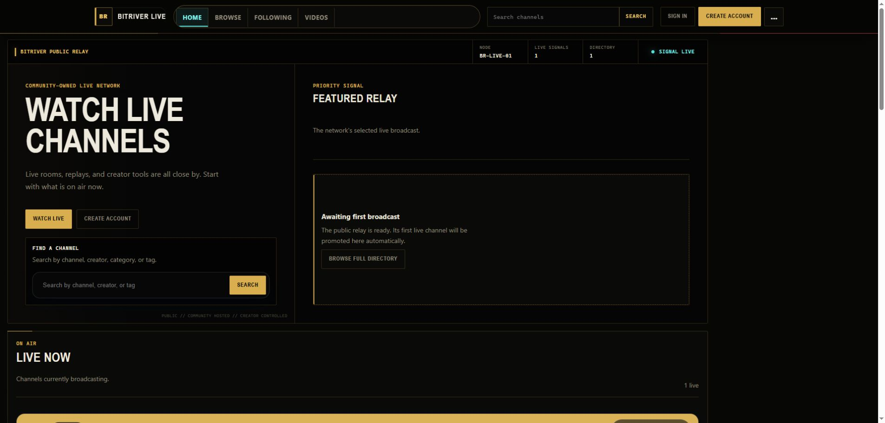
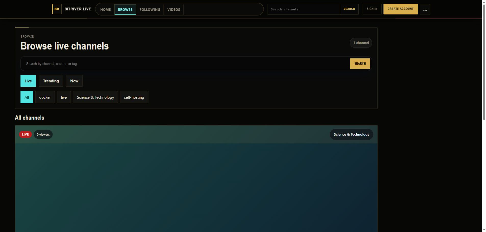
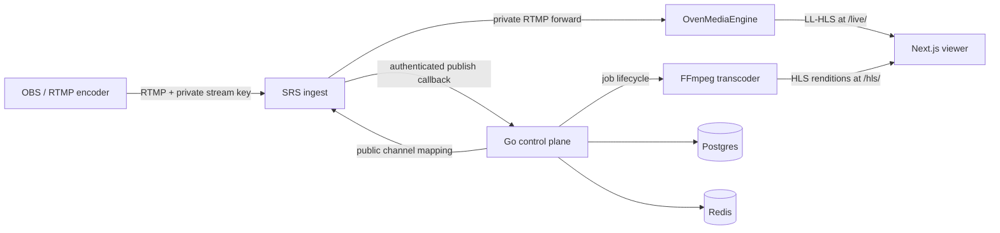

# BitRiver Live

[](https://github.com/ProhibitedTV/BitRiver-Live/actions/workflows/ci.yml)
[](https://github.com/ProhibitedTV/BitRiver-Live/releases)
[](LICENSE)

BitRiver Live is a self-hosted streaming website for one operator-managed host.
Creators publish from OBS over RTMP; viewers discover channels, watch low-latency
video, chat, follow creators, and play published VODs. The Go control plane,
Next.js viewer, media services, Postgres, and Redis ship as one Docker Compose
stack.

**Current public candidate:**
[`v1.2.3-rc.12`](https://github.com/ProhibitedTV/BitRiver-Live/releases/tag/v1.2.3-rc.12).
It is a prerelease for evaluation and staged home-hosting rollout, not a stable
or managed-service promise. RC12 predates the signed release-set root now on
`main`; verify RC12 with its `CHECKSUMS.txt` and bundled launcher signature.
The next candidate produced by the current workflow will add the complete
signed manifest described below.



_The shipped viewer running from the canonical Compose stack on Docker Desktop
for Windows. The account and channel are local demo data; this is a product
capture, not concept art._

## What you get

- A public Next.js viewer with live discovery, channel pages, chat, follows,
  schedules, and published VODs.
- Creator setup with channel creation, masked OBS credentials, live-state
  monitoring, share links, and uploads.
- A Go API and control centre with session auth, moderation, analytics,
  liveness, readiness, and aggregate dependency health.
- SRS RTMP ingest with authenticated callbacks and public channel mapping.
- OvenMediaEngine (OME) LL-HLS playback on the viewer's `/live/` origin.
- FFmpeg transcoding with 1080p, 720p, and 480p HLS renditions.
- Postgres persistence, Redis coordination, checksummed installers, SBOMs, and
  a boot-managed Ubuntu Compose lifecycle.



## Choose your path

| Goal | Supported entry point | What has been proved |
| --- | --- | --- |
| Evaluate on Windows | Source checkout + Docker Desktop Linux containers | Native PowerShell contract check and full local Compose/OME startup |
| Host on Ubuntu | RC12 `.deb` or launcher archive on Ubuntu Server 24.04 amd64 | Checksums, package install/remove, anonymous image pulls, and pull-only media/API product gate |
| Develop or contribute | Source checkout on Windows, macOS, or Linux | Cross-platform Go and entrypoint CI plus the canonical repository gate |

The Ubuntu package and archive are real public downloads. Clean XOA VM reboot,
Nginx Proxy Manager browser access, and repeated OME failure/recovery are still
operator acceptance checks; see [Production evidence boundary](#production-evidence-boundary).

## How a release is trusted

BitRiver builds once at a prerelease tag. The candidate workflow publishes the
cross-platform artifacts, five digest-addressed images, SBOMs, sanitized gate
evidence, complete checksums, and a keylessly signed `release-set.json`.
Stable promotion is a separate protected workflow: it copies those exact bytes
and retags those exact image digests after the tracked clean-host, recovery,
capacity, security, and browser gates pass. A stable tag never rebuilds an RC.

For production, trust the candidate or stable tag together with the digest in
the signed manifest. Do not use `latest` as an integrity or rollback source.
Revoked candidates receive signed append-only markers and cannot be promoted.
See [immutable candidate and stable promotion](docs/release-promotion.md) for
verification commands, approval records, rollback metadata, and the guarded
workflow.

## Try it on Docker Desktop for Windows

Prerequisites:

- Windows 11 with Docker Desktop using Linux containers and the WSL 2 backend
- Git
- Go 1.26 or newer (the repository and production builders pin Go 1.26.5)
- At least 4 logical CPUs, 8 GiB RAM, and 20 GiB free disk available to the stack

From PowerShell:

```powershell
git clone https://github.com/ProhibitedTV/BitRiver-Live.git
Set-Location BitRiver-Live
Copy-Item deploy\.env.example .env
go run ./cmd/bitriver env init --env-file .\.env
.\scripts\verify-windows-docker.ps1 -Start
```

The final command validates Docker Desktop and Compose, builds the first-party
images, runs migrations, starts the canonical stack, and requires successful
responses from:

- Viewer: <http://localhost:8080/viewer>
- Control centre: <http://localhost:8080/admin>
- Liveness: <http://localhost:8080/healthz>
- Dependency readiness: <http://localhost:8080/readyz>

It prints the exact cleanup command and leaves the stack available for
inspection. `.env` contains local credentials; never commit or post it.

For the shorter source path on Linux, macOS, or Git Bash:

```bash
cp deploy/.env.example .env
go run ./cmd/bitriver env init --env-file ./.env
BITRIVER_LIVE_MODE=development ./scripts/quickstart.sh --image-source build
```

See the [quickstart guide](docs/quickstart.md) for platform notes, profiles,
resource sizing, update commands, and troubleshooting.

## Install the Ubuntu release candidate

The production deployment target is Ubuntu Server 24.04 LTS on amd64 with
Docker Engine and the Compose plugin. Download the package and checksum from
the same immutable release:

```bash
release_tag=v1.2.3-rc.12
base_url="https://github.com/ProhibitedTV/BitRiver-Live/releases/download/${release_tag}"

curl -fLO "${base_url}/bitriver-live_${release_tag}_amd64.deb"
curl -fLO "${base_url}/CHECKSUMS.txt"
grep "  bitriver-live_${release_tag}_amd64.deb$" CHECKSUMS.txt | sha256sum --check -

sudo apt install "./bitriver-live_${release_tag}_amd64.deb"
sudo bitriver-host install --operator-user "$USER"
sudo bitriver-host configure
sudo bitriver-host doctor
```

Installation is deliberately two-phase. It installs a disabled systemd unit
and rotates sample credentials, but it does not expose the stack until public
URLs, trusted proxies, image digests, Docker access, and production validation
pass. Follow the [Ubuntu installation guide](docs/installing-on-ubuntu.md) to
finish configuration and activate it:

```bash
sudo bitriver-host activate
sudo bitriver-host status
```

Prefer a portable archive? The same release includes
`bitriver-launcher-linux-amd64.tar.gz`, plus Linux arm64 packages, RPMs, a
Windows MSI, launcher archives, a Homebrew formula, checksums, signatures, and
software bills of materials.

## First broadcast

1. Sign in with the bootstrapped administrator, or enable self-signup for a
   private evaluation.
2. Open **Creator setup**, create a channel, and copy the masked OBS settings.
3. In OBS, put the displayed RTMP URL in **Server** and the secret stream key in
   its separate **Stream Key** field.
4. Start streaming and wait for the channel to become live.
5. Open its public channel page in a second browser session. Confirm video,
   audio, chat, and the offline transition after OBS stops.

Never put a stream key in screenshots, issue bodies, logs, or committed files.

## How media moves


```mermaid
flowchart LR
  OBS["OBS / RTMP encoder"] -->|"RTMP + private stream key"| SRS["SRS ingest"]
  SRS -->|"authenticated publish callback"| API["Go control plane"]
  API -->|"public channel mapping"| SRS
  SRS -->|"private RTMP forward"| OME["OvenMediaEngine"]
  API -->|"job lifecycle"| FFmpeg["FFmpeg transcoder"]
  OME -->|"LL-HLS at /live/"| Viewer["Next.js viewer"]
  FFmpeg -->|"HLS renditions at /hls/"| Viewer
  API --> Postgres[("Postgres")]
  API --> Redis[("Redis")]
```

The private stream key never becomes the public OME stream name. SRS validates
the key through the control plane and forwards the broadcast as
`default/live/<channel-id>`. Public LL-HLS is then
`https://your-host/live/<channel-id>/llhls.m3u8`.

OME process health is not playback proof. Release and production acceptance
also require the declared `default/live` application, a real publish, manifest
retrieval, and several seconds of decoded audio/video.

## Home hosting behind Nginx Proxy Manager

The intended home-hosting shape is an Ubuntu VM on XCP-ng/XOA with Nginx Proxy
Manager (NPM) at the HTTPS edge:

- Forward the public app host to the VM on TCP `8080`; `/viewer`, `/api`,
  `/admin`, websocket routes, and `/live/` stay on that origin.
- Forward `/hls/` to the VM on TCP `9080` for transcoder renditions.
- Publish creator ingest separately on TCP `1935`. NPM's HTTP Proxy Host cannot
  carry RTMP; use an NPM Stream entry or another L4 path.
- Keep Postgres, Redis, SRS control, transcoder control, and the OME manager API
  private.
- Open OME signalling, relay, and UDP ICE ports only when you deliberately
  enable and test WebRTC. An HTTP reverse proxy does not replace those NAT and
  firewall rules.

Use the complete [NPM/Cloudflare guide](docs/reverse-proxy-npm-cloudflare.md)
and [single-host production runbook](docs/production-single-host.md), including
the exact trusted-proxy, TLS, firewall, and media-port guidance.

## Production evidence boundary

RC12 proves:

- checksum-complete public release assets and five anonymously readable GHCR
  image manifests;
- package install/inspect/remove on Ubuntu 24.04, Debian 12, and Rocky Linux 9;
- a pull-only tagged stack with authenticated configuration and bounded OME
  startup; and
- an eight-stage product gate covering accounts/channel creation, RTMP live
  state, decoded live media, offline transition, chat/moderation, VOD upload and
  playback, and aggregate status.

Before calling your own host production-ready, also record on that host:

- clean Ubuntu/XOA installation and firewall/NAT behavior;
- browser access through the real NPM/TLS path;
- authenticated OME manager access plus live and rendition playback;
- boot recovery after a VM reboot; and
- repeated OME restart/media recovery without stale live state or jobs.

The commands and evidence checklist are in the
[Ubuntu guide](docs/installing-on-ubuntu.md),
[release gates](docs/release-gates.md), and
[production release runbook](docs/production-release.md).

## Operate and recover

Installed Ubuntu host:

```bash
sudo bitriver-host status
sudo bitriver-host logs
sudo journalctl -u bitriver-live-compose.service -n 200 --no-pager
```

Source checkout:

```bash
docker compose --env-file .env -f deploy/docker-compose.yml ps
docker compose --env-file .env -f deploy/docker-compose.yml logs --tail=200 \
  bitriver-live srs-controller ome transcoder
go run ./cmd/bitriver smoke --env-file ./.env
```

Back up configuration, Postgres, and media state before upgrades. The Ubuntu
uninstaller preserves `/etc/bitriver-live` and `/var/lib/bitriver-live` unless
you supply both explicit purge flags. See [operations](docs/operations.md),
[upgrades and rollback](docs/upgrades.md), and
[security](docs/security.md).

## Support boundary

Supported and actively hardened:

- One operator-managed host using the canonical Docker Compose contract
- Source-checkout evaluation on Windows Docker Desktop, macOS, and Linux
- Ubuntu Server 24.04 amd64 as the first packaged production target
- RTMP ingest, OME LL-HLS, transcoding, viewer, chat, moderation, and VOD

Not promised:

- A managed BitRiver service
- Hands-off high availability, autoscaling, or multi-host failover
- Kubernetes as the primary installation path
- CDN or global-distribution guarantees
- Stable-release support while `v1.2.3` remains a release candidate

## Verify or contribute

Run the repository gate from Git Bash, Linux, or macOS:

```bash
./scripts/verify.sh --viewer
```

Read [CONTRIBUTING.md](CONTRIBUTING.md), [testing](docs/testing.md), and the
[deployment contract](docs/contract.md) before changing runtime behavior.
Security reports belong through [SECURITY.md](SECURITY.md), not a public issue.

Repository map:

- [`cmd/`](cmd) — process entrypoints and the deployment CLI
- [`internal/`](internal) — API, auth, ingest, storage, server, and runtime code
- [`web/viewer/`](web/viewer) — the public Next.js application
- [`deploy/`](deploy) — Compose, migrations, media config, and installers
- [`scripts/`](scripts) — quickstart, validation, backup, and release helpers
- [`docs/`](docs) — architecture, operator, security, testing, and release docs

Start with [quickstart](docs/quickstart.md), [architecture](docs/architecture.md),
[stream lifecycle](docs/stream-lifecycle.md), [support](SUPPORT.md), and the
[changelog](CHANGELOG.md).
