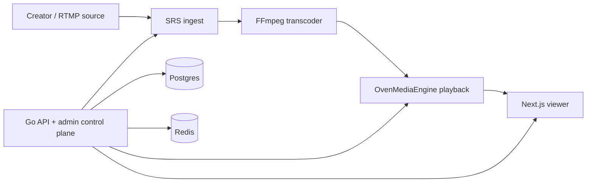

# BitRiver Live

BitRiver Live bundles the moving pieces of a self-hosted live-streaming stack into one repository and one deployment contract. Instead of stitching together ingest, transcoding, playback, a public viewer, and admin tooling yourself, you run one documented Docker Compose stack from the repository root.

It is built for operators who are comfortable managing a single host. It is not a managed service, a Kubernetes-first platform, or a hands-off autoscaling product.

## At a glance

- Supported baseline: operator-managed single-host deployment.
- Includes: Go control plane, Next.js viewer, SRS ingest, OvenMediaEngine playback, FFmpeg-based transcoding, Postgres, and Redis.
- Fastest honest evaluation path: source checkout plus `go run ./cmd/bitriver quickstart`.
- Before production: read [`docs/production-single-host.md`](docs/production-single-host.md), [`docs/security.md`](docs/security.md), and [`docs/production-release.md`](docs/production-release.md).


## Support boundary

BitRiver Live is aimed at teams who want one reproducible stack and are willing to operate it themselves.

### What works today

- Single-host Docker Compose deployment of the Go API and admin control plane, Next.js viewer, SRS ingest, OvenMediaEngine playback, FFmpeg-based transcoding, Postgres, and Redis.
- Source-based quickstart and packaged launcher paths that converge on the same deployment contract.
- Admin bootstrap, health endpoints, release packaging, and CI/release automation.

### What is planned next

- Continued hardening of the install, packaging, and release story around the supported single-host baseline.
- Better public release discipline through changelog updates, release notes, and contributor workflow polish.
- Evaluation of broader deployment topologies only after the supported baseline stays clear and dependable.

### What is not supported

- Managed hosting or a BitRiver-operated SaaS.
- Kubernetes as the primary deployment path in this repository.
- Hands-off HA, auto-scaling, or multi-host guarantees.
- "No planning required" global distribution or CDN behavior.

## Quickstart

This is the fastest source-based path from a checkout to a working local stack. First run can take several minutes while Docker pulls or builds images.

### Prerequisites

- Docker with Compose V2
- Go 1.21+
- Enough local disk for images and stateful services

### 1. Create a local environment file

Copy [`deploy/.env.example`](deploy/.env.example) to `.env` at the repository root.

```bash
cp deploy/.env.example .env
```

PowerShell:

```powershell
Copy-Item deploy/.env.example .env
```

### 2. Initialize local secrets and defaults

```bash
go run ./cmd/bitriver env init --env-file ./.env
```

Want setup-wizard style control over the generated `.env` instead of the default one-prompt flow? Run:

```bash
go run ./cmd/bitriver env init --env-file ./.env --wizard
```

The wizard guides you through the admin email, viewer/API URLs, API port, OME host settings, transcoder public URL, and self-signup while still auto-generating any missing required secrets.

### 3. Start the local evaluation stack

For a local source-based demo, keep the saved `.env` in production mode and use a temporary development override:

```bash
BITRIVER_LIVE_MODE=development go run ./cmd/bitriver quickstart --compose-file deploy/docker-compose.yml --image-source build
```

PowerShell:

```powershell
$env:BITRIVER_LIVE_MODE = "development"
go run ./cmd/bitriver quickstart --compose-file deploy/docker-compose.yml --image-source build
Remove-Item Env:BITRIVER_LIVE_MODE
```

### 4. Verify the install

```bash
go run ./cmd/bitriver smoke --env-file ./.env
```

Success looks like:

- `http://localhost:8080/viewer` serves the public viewer
- `http://localhost:8080/admin` opens the control centre
- `go run ./cmd/bitriver smoke --env-file ./.env` passes

Need packaged launchers, the platform matrix, or production-mode details? Start with [`docs/quickstart.md`](docs/quickstart.md).

## Architecture at a glance


```mermaid
flowchart LR
  Creator["Creator / RTMP source"] --> SRS["SRS ingest"]
  SRS --> Transcoder["FFmpeg transcoder"]
  Transcoder --> OME["OvenMediaEngine playback"]
  OME --> Viewer["Next.js viewer"]
  API["Go API + admin control plane"] --> Viewer
  API --> Postgres[("Postgres")]
  API --> Redis[("Redis")]
  API --> SRS
  API --> OME
```

## How the repo is organized

- [`cmd/`](cmd) - process entrypoints and deployment CLI
- [`internal/`](internal) - application, domain, API, storage, auth, ingest, and supporting packages
- [`web/viewer/`](web/viewer) - public-facing Next.js viewer
- [`deploy/`](deploy) - canonical deployment assets, env template, Compose stack, and installers
- [`docs/`](docs) - quickstart, production, architecture, security, testing, and operations docs

## Key docs

- Quickstart: [`docs/quickstart.md`](docs/quickstart.md)
- Architecture: [`docs/architecture.md`](docs/architecture.md)
- Deployment contract: [`docs/contract.md`](docs/contract.md)
- Single-host production baseline: [`docs/production-single-host.md`](docs/production-single-host.md)
- Security hardening: [`docs/security.md`](docs/security.md)
- Monitoring: [`docs/monitoring.md`](docs/monitoring.md)
- Upgrades: [`docs/upgrades.md`](docs/upgrades.md)
- Release gates: [`docs/release-gates.md`](docs/release-gates.md)
- Release process: [`docs/production-release.md`](docs/production-release.md)
- Versioning policy: [`docs/versioning.md`](docs/versioning.md)
- Support expectations: [`SUPPORT.md`](SUPPORT.md)

## Development and verification

Recommended repo gate:

```bash
./scripts/verify.sh
```

PowerShell:

```powershell
.\scripts\verify.ps1
```

`verify.ps1` delegates to the same `./scripts/verify.sh` gate after finding a usable Bash. It prefers Git for Windows Bash before falling back to `bash` on `PATH`, which avoids the common broken-WSL case where Windows `bash.exe` reports no default distro.

Common focused commands:

```bash
GOTOOLCHAIN=local GOPROXY=off GOSUMDB=off go test ./... -count=1 -timeout=120s
npm --prefix web/viewer run lint
npm --prefix web/viewer run test
docker compose --env-file .env -f deploy/docker-compose.yml config
```

## Support and project policies

- Support guide: [`SUPPORT.md`](SUPPORT.md)
- Contributing guide: [`CONTRIBUTING.md`](CONTRIBUTING.md)
- Security policy: [`SECURITY.md`](SECURITY.md)
- Code of conduct: [`CODE_OF_CONDUCT.md`](CODE_OF_CONDUCT.md)
- Changelog: [`CHANGELOG.md`](CHANGELOG.md)
- License: [`LICENSE`](LICENSE)

## Release readiness

The repository already contains release automation under [`.github/workflows/release.yml`](.github/workflows/release.yml), but a tagged release is still an operational event:

- verify the canonical deployment contract
- rotate real secrets for the target environment
- classify promotion evidence through the gate ladder in [`docs/release-gates.md`](docs/release-gates.md)
- confirm docs, changelog, release notes, and digests agree on the final tag
- follow the checklist in [`docs/production-release.md`](docs/production-release.md)

If code and docs disagree, treat the code as the immediate source of truth and fix the docs in the same change where possible.
