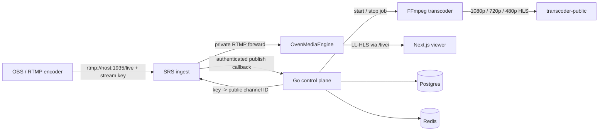

# BitRiver Live

BitRiver Live is a self-hosted live-streaming website: creators publish over RTMP, viewers browse and watch channels, and operators run the control plane, media services, and stateful dependencies as one Docker Compose stack.

The supported baseline is one operator-managed Linux host—or Docker Desktop using Linux containers for evaluation. It is not a managed service, an autoscaling platform, or a Kubernetes-first product.

> **Release status:** install from a source checkout today. This repository does not currently publish a GitHub Release, Ubuntu package, or downloadable installer. The release workflows and Ubuntu installer work are being hardened, but this README will not point at artifacts that do not exist.


_The shipped Next.js viewer, captured from the canonical Compose stack on Docker Desktop for Windows. The account and channel are local demo data; no mockup or concept art is used._

## What ships today

- A public Next.js viewer with discovery, channels, live chat, follows, schedules, and published VODs.
- Creator onboarding with channel creation, masked stream credentials, live-state monitoring, sharing, and uploads.
- A Go API and admin/control centre with session auth, moderation, analytics, health, and readiness endpoints.
- SRS RTMP ingest with token-authenticated callbacks and per-channel forwarding.
- OvenMediaEngine (OME) LL-HLS playback through the same public `/live/` origin as the viewer.
- FFmpeg transcoding jobs with 1080p, 720p, and 480p HLS renditions.
- Postgres for durable product state and Redis for shared chat/runtime coordination.
- A canonical root `.env` plus [`deploy/docker-compose.yml`](deploy/docker-compose.yml) deployment contract.


## The working media path


```mermaid
flowchart LR
  OBS["OBS / RTMP encoder"] -->|"rtmp://host:1935/live + stream key"| SRS["SRS ingest"]
  SRS -->|"authenticated publish callback"| API["Go control plane"]
  API -->|"key -> public channel ID"| SRS
  SRS -->|"private RTMP forward"| OME["OvenMediaEngine"]
  API -->|"start / stop job"| FFmpeg["FFmpeg transcoder"]
  OME -->|"LL-HLS via /live/"| Viewer["Next.js viewer"]
  FFmpeg -->|"1080p / 720p / 480p HLS"| Media["transcoder-public"]
  API --> Postgres[("Postgres")]
  API --> Redis[("Redis")]
```

The public stream key never becomes the OME stream name. SRS accepts the private key, asks the control plane for the public channel mapping, and forwards to OME as `default/live/<channel-id>`. Viewer playback is then `https://your-host/live/<channel-id>/llhls.m3u8`.

OME process health alone is not accepted as playback proof. The deployment path validates the declared `default/live` application, and release acceptance still requires a bounded real publish plus manifest/decode checks.

## Quick evaluation

### Prerequisites

- Docker Engine or Docker Desktop with Compose V2
- Linux containers (`desktop-linux` / WSL 2 on Windows)
- Go 1.26 or newer; CI and images currently pin Go 1.26.5
- Enough disk for the application images and Postgres/Redis/media state

### 1. Create and initialize `.env`

macOS, Linux, or Git Bash:

```bash
cp deploy/.env.example .env
go run ./cmd/bitriver env init --env-file ./.env
```

Windows PowerShell:

```powershell
Copy-Item deploy/.env.example .env
go run ./cmd/bitriver env init --env-file .\.env
```

The initializer generates required local secrets. Do not commit `.env`.

### 2. Start from source

macOS, Linux, or Git Bash:

```bash
BITRIVER_LIVE_MODE=development ./scripts/quickstart.sh --image-source build
```

Windows PowerShell:

```powershell
$env:BITRIVER_LIVE_MODE = "development"
.\scripts\quickstart.ps1 --env-file .env --compose-file deploy/docker-compose.yml --image-source build
Remove-Item Env:BITRIVER_LIVE_MODE
```

Open:

- Viewer: <http://localhost:8080/viewer>
- Admin/control centre: <http://localhost:8080/admin>
- Liveness: <http://localhost:8080/healthz>
- Dependency readiness: <http://localhost:8080/readyz>

The source command behind both wrappers is:

```bash
go run ./cmd/bitriver quickstart --compose-file deploy/docker-compose.yml --image-source build
```

### 3. Prove Docker Desktop for Windows

From native PowerShell after `.env` is initialized:

```powershell
.\scripts\verify-windows-docker.ps1 -Start
```

This checks that Docker Desktop is reachable in Linux-container mode, validates Compose, builds this checkout, starts the canonical stack, and waits for `/healthz`, `/readyz`, `/viewer`, and `/admin`. Failures identify whether Docker itself is stopped/inaccessible or the repository contract failed.

For config/engine validation without starting services:

```powershell
.\scripts\verify-windows-docker.ps1
```

See [`docs/quickstart.md`](docs/quickstart.md) for resource sizing, profiles, update commands, and troubleshooting.

## First stream workflow

1. Enable self-signup for a local evaluation or sign in with the bootstrapped admin account.
2. Open **Creator setup**, create a channel, and copy the masked OBS settings.
3. In OBS, use the displayed RTMP server URL and paste the stream key into its separate key field.
4. Start streaming. SRS validates the key, the channel transitions live, OME publishes LL-HLS, and the transcoder records the configured rendition URLs.
5. Open the public channel link in a second browser session and verify video, audio, chat, and the offline transition when OBS stops.

Never put the stream key in screenshots, issue bodies, terminal transcripts, or committed config.

## Home hosting: Ubuntu VM + XOA + Nginx Proxy Manager

The intended production shape is an Ubuntu 24.04 LTS VM on XCP-ng/XOA, with Docker Compose on the VM and Nginx Proxy Manager (NPM) providing the public HTTPS edge.

- Send the public HTTP host to BitRiver on port `8080`. The viewer, API, chat websocket, admin surface, and OME LL-HLS path are all served on that origin (`/viewer`, `/api`, `/admin`, and `/live`).
- Enable websocket forwarding for `/api/chat/ws` and other documented realtime routes.
- Publish creator RTMP separately on TCP `1935`. NPM's HTTP proxy-host screen cannot carry RTMP; use an NPM **Stream** entry, a direct DNS/LAN/VPN route, or another TCP proxy. A normal Cloudflare orange-cloud record does not proxy RTMP.
- Treat direct OME HTTP/API ports as private diagnostics. The golden viewer path is `/live/` through BitRiver, not a second public OME origin.
- Keep Postgres, Redis, the SRS control API, the transcoder control API, and the OME manager API off the public network.

Start with [`docs/installing-on-ubuntu.md`](docs/installing-on-ubuntu.md), [`docs/reverse-proxy-npm-cloudflare.md`](docs/reverse-proxy-npm-cloudflare.md), [`docs/production-single-host.md`](docs/production-single-host.md), and [`docs/security.md`](docs/security.md).

## Operational acceptance

Container status is useful, but it is not the finish line. Before putting an instance behind a public proxy, prove all of the following:

- `docker compose ... config` renders with the intended `.env`.
- `/healthz`, `/readyz`, `/viewer`, and `/admin` return successfully.
- OME reaches healthy state within a bounded timeout and its declared `default/live` application is readable through the authenticated manager API.
- A real RTMP publish transitions the channel live without exposing its stream key.
- `/live/<channel-id>/llhls.m3u8` returns through the public origin and at least several seconds of video and audio decode.
- All advertised rendition manifests return successfully.
- Stopping the publisher returns the channel offline; retry/restart does not leave stale jobs or a permanently live channel.
- Backups, restore, firewall rules, TLS, and log rotation match the runbooks.

Useful operator commands:

```bash
docker compose --env-file .env -f deploy/docker-compose.yml ps
docker compose --env-file .env -f deploy/docker-compose.yml logs --tail=200 bitriver-live srs-controller ome transcoder
go run ./cmd/bitriver smoke --env-file ./.env
```

## Support boundary

Supported and actively hardened:

- One operator-managed host
- Docker Compose with Postgres and Redis
- Source-checkout evaluation on Linux/macOS and Windows Docker Desktop
- RTMP ingest, OME LL-HLS, transcoding, viewer, chat, moderation, and VOD workflows described in this repository

Not promised:

- A managed BitRiver service
- Hands-off high availability, autoscaling, or multi-host failover
- Kubernetes as the primary install path
- CDN/global distribution guarantees
- An installer, package, or immutable release artifact before one is actually published

## Repository map

- [`cmd/`](cmd) — process entrypoints and the deployment CLI
- [`internal/`](internal) — API, domain, auth, ingest, storage, server, and runtime code
- [`web/viewer/`](web/viewer) — the public Next.js application
- [`deploy/`](deploy) — Compose, migrations, SRS/OME/nginx configuration, Helm assets, and installers
- [`scripts/`](scripts) — quickstart, validation, backup/restore, and release helpers
- [`docs/`](docs) — architecture, operator, security, testing, and release runbooks

## Verification and contribution

Run the repository gate from Git Bash, Linux, or macOS:

```bash
./scripts/verify.sh --viewer
```

Common focused checks:

```bash
GOTOOLCHAIN=local GOPROXY=off GOSUMDB=off go test ./... -count=1 -timeout=120s
npm --prefix web/viewer run lint
npm --prefix web/viewer run test
npm --prefix web/viewer run build
docker compose --env-file .env -f deploy/docker-compose.yml config
```

Read [`CONTRIBUTING.md`](CONTRIBUTING.md), [`docs/testing.md`](docs/testing.md), and [`docs/contract.md`](docs/contract.md) before changing runtime behavior. Security reports belong through [`SECURITY.md`](SECURITY.md), not a public issue.

## Key docs

- [Quickstart](docs/quickstart.md)
- [Deployment contract](docs/contract.md)
- [Architecture](docs/architecture.md)
- [Stream lifecycle](docs/stream-lifecycle.md)
- [Operations](docs/operations.md)
- [Single-host production baseline](docs/production-single-host.md)
- [Nginx Proxy Manager / Cloudflare](docs/reverse-proxy-npm-cloudflare.md)
- [Security](docs/security.md)
- [Release gates](docs/release-gates.md)
- [Production release runbook](docs/production-release.md)
- [Support](SUPPORT.md)
- [Changelog](CHANGELOG.md)
- [MIT License](LICENSE)
