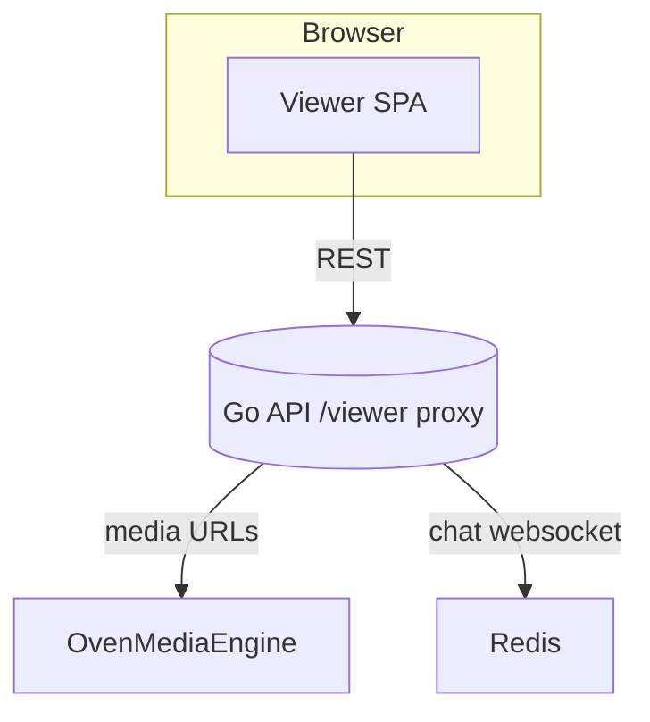

# BitRiver Live Viewer

This directory hosts the public-facing Next.js application that lets viewers browse channels and watch streams.

## How it fits in



The viewer talks to the Go API for channel data, chat, and authentication. When you serve it through the Go binary, requests to `/viewer` are reverse-proxied to this app.

## Prerequisites

- [Node.js 18+](https://nodejs.org/en/download/package-manager)
- npm (bundled with Node.js on most platforms)
- A running BitRiver Live API (follow the [Docker quickstart](../../README.md#quick-start-docker-one-command) or the manual workflow in the root README)

## Quick preview

1. Change into the viewer directory and install dependencies:
   ```bash
   cd web/viewer
   npm install
   ```
2. Point the client at your API and start the development server:
   ```bash
   NEXT_PUBLIC_API_BASE_URL="http://localhost:8080" npm run dev
   ```
   Omit `NEXT_PUBLIC_API_BASE_URL` if the viewer and API share the same origin.

The viewer runs on [http://localhost:3000](http://localhost:3000) with hot reload so you can browse channels, open chat, and iterate on styling in real time.

## Production build

1. Install exact dependency versions and compile a standalone build:
   ```bash
   cd web/viewer
   npm ci
   NEXT_PUBLIC_API_BASE_URL="https://api.example.com" NEXT_VIEWER_BASE_PATH=/viewer npm run build
   ```
   Adjust `NEXT_PUBLIC_API_BASE_URL` to match your public API URL. Set `NEXT_VIEWER_BASE_PATH` to `/viewer` when you plan to proxy the app through the Go API; leave it unset to serve from the root.
2. Serve the compiled output from the project root:
   ```bash
   node .next/standalone/server.js
   ```
   The standalone output expects the static assets from `.next/static` and `public/` to be available alongside the server binary (the systemd and Docker manifests copy them into place for you).

Set `BITRIVER_VIEWER_ORIGIN` on the Go API (for example, `http://127.0.0.1:3000`) so `/viewer` requests proxy to the running Next.js server.
