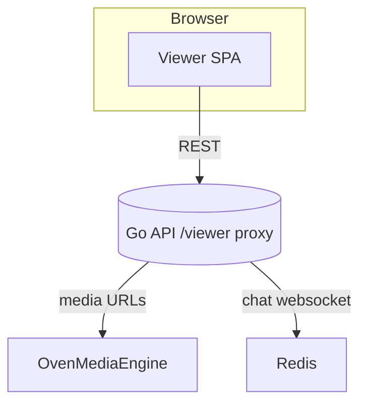

# BitRiver Live Viewer

This directory hosts the public-facing Next.js application that lets viewers browse channels and watch streams.

## How it fits in


```mermaid
flowchart TB
  subgraph Browser
    ViewerUI[Viewer SPA]
  end
  ViewerUI -->|REST| API[(Go API /viewer proxy)]
  API -->|media URLs| OME[OvenMediaEngine]
  API -->|chat websocket| Redis
```

The viewer talks to the Go API for channel data, chat, and authentication. When you serve it through the Go binary, requests to `/viewer` are reverse-proxied to this app.

## Prerequisites

- [Node.js 18+](https://nodejs.org/en/download/package-manager)
- npm (bundled with Node.js on most platforms)
- A running BitRiver Live API (follow the [root quickstart](../../README.md#quickstart) or the more detailed manual workflow in the root docs)

## Quick preview

1. Change into the viewer directory and install dependencies:
   ```bash
   cd web/viewer
   npm install
   ```
2. Point the client at your API and start the development server:
   ```bash
   NEXT_PUBLIC_API_BASE_URL="http://localhost:8080" npm run dev
   ```
   Omit `NEXT_PUBLIC_API_BASE_URL` if the viewer and API share the same origin.

The viewer runs on [http://localhost:3000](http://localhost:3000) with hot reload so you can browse channels, open chat, and iterate on styling in real time.

## Production build

1. Install exact dependency versions and compile a standalone build:
   ```bash
   cd web/viewer
   npm ci
   NEXT_PUBLIC_API_BASE_URL="https://api.example.com" NEXT_VIEWER_BASE_PATH=/viewer npm run build
   ```
   Adjust `NEXT_PUBLIC_API_BASE_URL` to match your public API URL. Set `NEXT_VIEWER_BASE_PATH` to `/viewer` when you plan to proxy the app through the Go API; leave it unset to serve from the root.
2. Serve the compiled output from the project root:
   ```bash
   node .next/standalone/server.js
   ```
   The standalone output expects the static assets from `.next/static` and `public/` to be available alongside the server binary (the systemd and Docker manifests copy them into place for you).

Set `BITRIVER_VIEWER_ORIGIN` on the Go API (for example, `http://127.0.0.1:3000`) so `/viewer` requests proxy to the running Next.js server.


## Navigation contract

`components/Navbar.tsx` reads persistent route tabs and drawer quick links from
`lib/navigation.ts`.

The persistent header is intentionally viewer-first: home, browse, following,
videos, and search stay visible by default. Profile, creator setup/go-live,
admin control center, setup guidance, and theme switching live in the compact
account/site menu or mobile drawer so utility actions do not crowd the default
watching and discovery path.

When adding or changing viewer routes in the navbar:

1. Update `CANONICAL_NAV_ITEMS` only for persistent viewer discovery routes.
2. Update `CANONICAL_QUICK_LINK_ITEMS` for secondary drawer shortcuts.
3. Use `visibleTo` and `getNavigationAudience` to define role visibility for
   `guest`, `member`, `creator`, and `admin` personas.
4. Keep `npm run test -- navigation.test.ts` green to verify the visibility
   matrix and duplicate-link guard rails.

This keeps route definitions and role policy in one shared module so desktop
and mobile navigation stay consistent.

## Browse URL contract

- `/browse?q=...` performs free-text directory search across channel title,
  owner display name, category, and tags.
- `/browse?category=...` applies an exact category filter and is the URL shape
  used by homepage category chips.

## Auth Landing Contract

- Viewer `Sign in` and `Join` CTAs now open an in-viewer auth overlay instead
  of treating `/signup` as the primary destination.
- The overlay keeps a safe `next` route in the current URL so successful auth
  can continue where the viewer left off without dropping out of `/viewer`.
- `/signup` is now a compatibility path for viewer-enabled installs: it
  forwards into the viewer overlay when the Next.js viewer is configured, and
  only falls back to the embedded static auth page when no viewer runtime is
  available.

## Chat Control Contract

- Keep the live chat header focused on room identity, live/offline state,
  viewer-facing counts, message count, and compact sync state.
- Keep the channel watch page video-first: desktop uses chat as a right-side
  dock, while smaller screens stack chat below the player.
- Preserve transcript position while viewers read older messages; auto-follow
  only when they are already near the bottom and offer a jump-to-latest control
  for background arrivals.
- Render system and moderation chat events as distinct transcript rows, not as
  ordinary user messages.
- Put secondary actions such as pop-out, sync detail, and display toggles behind
  the compact chat options control.
- Channel owners, admins, and moderators can use compact message-row moderation
  actions or slash commands. Normal viewers should only see report controls.
- Viewer slash commands map to the chat gateway: `/timeout <user> <duration>
  [reason]`, `/ban <user> [reason]`, `/unban <user>`, `/remove_timeout <user>`,
  and `/clear`.
- `/clear` only clears the local transcript view. It must not be presented as a
  room-history deletion command.
- Reports should open a separate review dialog/sheet instead of expanding the
  message row inside the thread.
- Signed-out chat should present one clear sign-in CTA rather than a disabled
  composer that looks broken.
- Message deletion/removal and `/me` action messages are follow-up work because
  the current gateway has no persisted event contract for them.

## Testing

Run the lint, unit, and Playwright suites from the viewer directory:

```bash
cd web/viewer
npm install
npm run lint
npm run test
npm run test:playwright
```

The Playwright config builds the app and starts `npm run start:test` on port
3000 by default. Set `PLAYWRIGHT_BASE_URL` if you want to point the tests at an
already running viewer instance. The specs stub API calls (including
`tests/stream-playback.spec.ts`, which seeds playback metadata and chat
transcripts) so you do not need a live backend to exercise UI flows.

## Dependency upgrade cadence

Plan a monthly dependency review (for example, during the first week of each
month) so runtime and tooling updates stay predictable.

Baseline upgrade steps:

1. From `web/viewer`, install dependencies:
   ```bash
   npm install
   ```
2. Bump `next`, `eslint-config-next`, and `typescript` together to keep the
   Next.js toolchain in sync:
   ```bash
   npm install next@latest eslint-config-next@latest typescript@latest
   ```
3. Verify the viewer suites after upgrading:
   ```bash
   npm run lint
   npm run test
   npm run test:playwright
   ```
